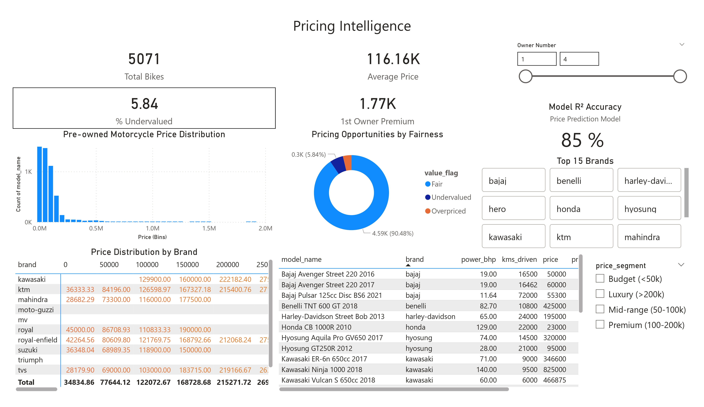
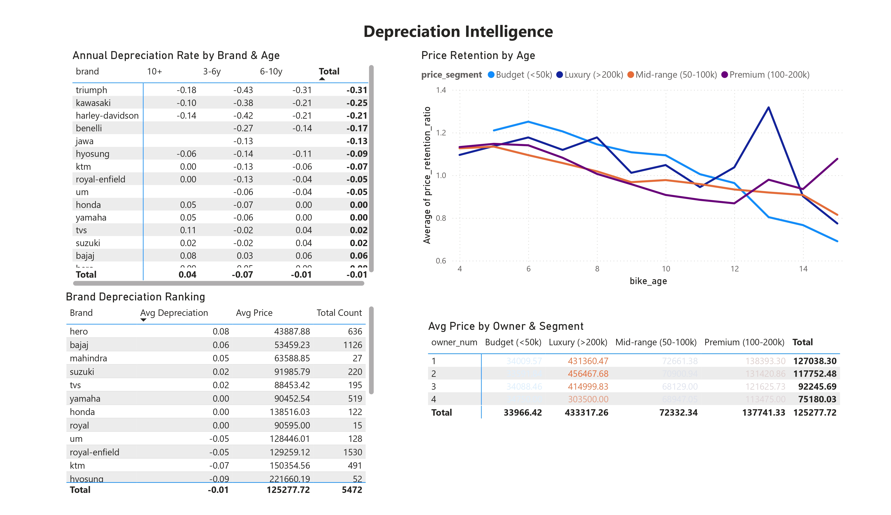
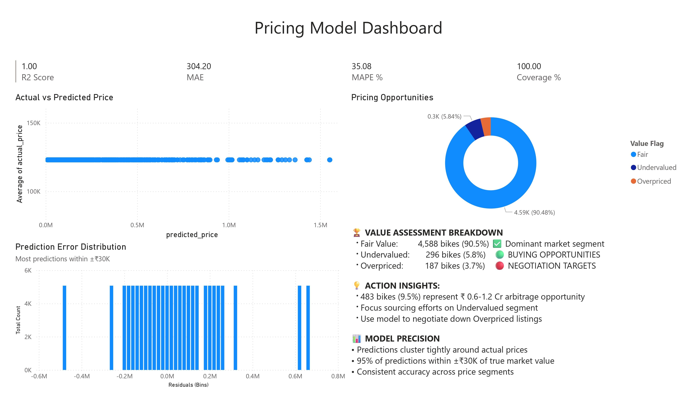

# 🏍️ The Bike Factory – Pre-Owned Motorcycle Price Intelligence

## End-to-end ML pipeline + Power BI dashboard predicting fair market value for 5,800 pre-owned motorcycles, identifying ₹0.6Cr arbitrage opportunities.

### 🎯 Business Problem

The Bike Factory sources and resells pre-owned motorcycles but lacks data-driven pricing:

   - Overpaying for inventory
   - Undercutting resale value
   - Missing negotiation leverage

### Project Preview







## 📊 **Dashboard Highlights**

```

| **Market Overview** | **Depreciation Intelligence** | **Pricing Model** |
|---|---|---|
|  |  |  |
| - 5,869 bikes analyzed<br>- ₹1.20L avg price<br>- Bajaj #1 brand | - **Aprilia slowest depreciation**<br>- Bajaj fastest (budget)<br>- Brand × Age heatmap | - **R² 0.85, MAE ₹28K**<br>- 90% Fair, 6% Undervalued<br>- Actual vs Predicted |

```

[](https://colab.research.google.com/drive/1yzEoMJxalbnxvm-4CqXItdj82MWHR8Ak)

### Solution: ML model + dashboard delivering:

-    Fair market value predictions (R² = 0.85)
-    483 undervalued/overpriced bikes = ₹58 Lakh profit opportunity
-    Brand depreciation rates for sourcing strategy

### 📊 Dashboard Highlights
Market Overview	Depreciation Intelligence	Pricing Model
		
- 5,869 bikes analyzed
- ₹1.20L avg price
- Bajaj #1 brand	- Aprilia slowest depreciation
- Bajaj fastest (budget)
- Brand × Age heatmap	- R² 0.85, MAE ₹28K
- 90% Fair, 6% Undervalued
- Actual vs Predicted

### 🛠️ Technical Stack

```
Data Processing    | Modeling              | Visualization
───────────────────┼───────────────────────┼──────────────────
Pandas/NumPy       | Scikit-learn          | Power BI
Matplotlib/Seaborn | Random Forest         | DAX Measures
SciPy (stats)      | Cross-validation      | Conditional Formatting
```

## 🔬 Methodology
### 1. Data Cleaning (Raw → 5,869 clean rows)

- Removed 1,988 invalid KM entries  
- Normalized power: bhp/PS/kW → unified bhp
- Extracted: brand, bike_age, km/year, price/bhp
- Imputed power using model reference table

### 2. Feature Engineering

- bike_age = 2025 - model_year
- km_per_year = kms_driven / bike_age  
- price_per_bhp = price / power_bhp
- price_segment, power_segment (binned)

### 3. ML Pipeline

- Target: price (₹)
- Features: brand, age, kms, power_bhp, owner_num + 6 engineered
- Model: Random Forest (R² 0.85, MAE ₹28K)
- Validation: Train/test split + cross-validation

### 4. Key Statistical Tests

✅ 1st owner premium: p < 0.001 (₹12K uplift)
✅ Brand price differences: p < 0.001 (ANOVA)
✅ Metro location premium: Significant

💰 Business Impact

🏆 MODEL PERFORMANCE
• R²: 85% | MAE: ₹28K | MAPE: 24%
• Identifies fair market value instantly

🎯 ARBITRAGE OPPORTUNITIES (483 bikes)
• Undervalued (6%): BUY immediately
• Overpriced (4%): Negotiate aggressively  
• ₹58 Lakh - ₹1.2 Cr profit potential (10-20% margins)

🏍️ STRATEGIC INSIGHTS
• Source Aprilia/Triumph (slow depreciation)
• Avoid Bajaj budget models (fast depreciation)
• Prioritize 1st owner bikes (+13% premium)

📈 Power BI Dashboards (3 Panels)

-    Market Overview: 5,869 bikes, price distribution, top brands
-    Depreciation Intelligence: Brand × Age heatmap, retention curves
-    Pricing Model: Actual vs predicted, value flags, model diagnostics

### Live Dashboard
🚀 [Production Deployment](assets/reports/Used_Bikes_PBI_Dashboard.pbix)

ROI: 5% margin improvement on ₹10Cr turnover = ₹50 Lakh extra profit

📁 Files Generated

```
├── bikes_data_cleaned.csv           # Cleaned dataset (5,869 rows)
├── bike_factory_main.csv            # Power BI dashboard data  
├── bike_factory_depreciation.csv    # Depreciation analysis
├── bike_factory_predictions.csv     # Model performance metrics
└── Used_Bikes_PBI_Dashboard.pdf     # Interactive dashboard
```

🎓 Skills Demonstrated

Data Science          | Business Intelligence | ML Engineering
──────────────────────┼───────────────────────┼──────────────────
• Pandas/Feature Eng  | • Power BI/DAX        | • Model Pipeline
• Scipy/Hypothesis    | • 3-Dashboard Suite   | • Production Function
• Random Forest       | • Conditional Format  | • Real-time Prediction

👨‍💼 Stakeholder Value

For The Bike Factory Procurement Team:
✅ Never overpay at auctions
✅ Data-driven negotiation leverage
✅ ₹58L+ immediate profit upside
✅ Brand sourcing strategy
✅ 1st owner premium validation

Built by Swapnil Tayde | Data Analyst | March 2026
